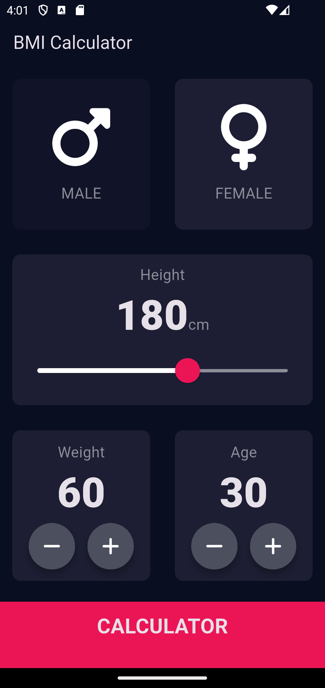

# 🧮 BMI Calculator

A clean and interactive **BMI (Body Mass Index) Calculator** built using **Flutter**. This app helps users to quickly calculate their BMI and provides health suggestions based on the result.

---

## ✨ Features

- Select gender (Male/Female)
- Adjust height using a slider
- Increase/decrease weight and age using custom buttons
- View your BMI result along with a compliment and suggestion
- Beautiful and responsive UI

---

## 📸 Screenshots

  
<br>


## 🚀 Getting Started

### 1. Clone the repository
```bash
git clone https://github.com/your-username/bmi_calculator.git
